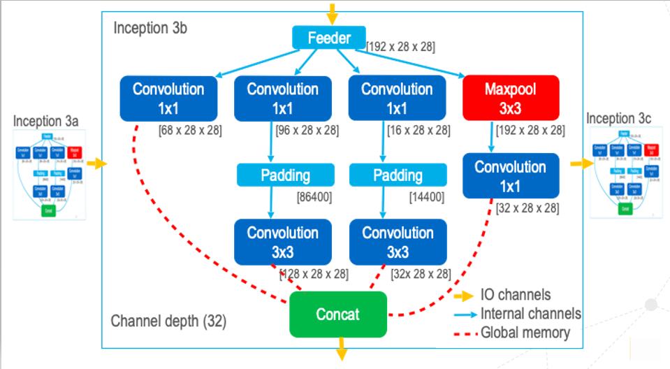

### GoogLeNet Hybrid Design :  
This dir contains hybrid design files for Googlenet. 
The combination of internal channels , external channels (IO channels) and global memory  for transferring data between kernels is being referred to as Hybrid Design.  

We had to choose this design style because the design with pure channels was stalling.  We decided to remove the channels which were supposedly causing stalls and replaced them with global memory tranfers.  

Inception 1a-3a does not need hybrid design as we did not face any stalls while running it. Every other kernel file has been modified to support global memory transfers between parents of Concat and Concat kernels.

Hybrid Design has been implemented as :  

The bitstreams have been generated and kept at :
- Bitstream location : `/upb/scratch/departments/pc2/groups/pc2-cc-user/custonn2/designs/debug_concat_bitstream`

The result of running these kernels are in :   
- Profile.mon locations : `/upb/scratch/departments/pc2/groups/pc2-cc-user/custonn2/designs/debug_concat_bitstream/profile_mons/profile_updated`

The performance model for these kernels when they were run on 5 nodes is in :
[Performance model Googlenet Hybrid Design](https://git.uni-paderborn.de/cs-hit/pg-custonn2-2018/blob/Performance_Model/Performance_Model/GoogLeNet_Hybrid_Design_Performance_Modelling.md)

## Steps to run GoogLenet Hybrid Design using OpenVINO FPGA Plugin from dldt/plugin_integration_branch :

### Connecting to Noctua Cluster
1. Connect to the Noctua Load Balancer  
    `ssh fe.noctua.pc2.uni-paderborn.de`  
2. Connect to Noctua FPGA front nodes  
    `ssh noctua`
3. Load OpenMPI,CMake and GCC modules  
    - `module load intel/18.0.3`
	- `module load mpi/OpenMPI/1.10.3-GCC-5.4.0-2.26`
	- `module load intelFPGA_pro/19.1.0 nalla_pcie/19.1.0 gcc/6.1.0`
	- `module load devel/CMake/3.6.1-foss-2016b`

### Build the OpenVINO noctua plugin containing MPI
If you are building the Inference Engine for the first time , please refer to this documentation: https://git.uni-paderborn.de/cs-hit/pg-custonn2-2018-3rd-party/dldt/blob/noctua_plugin_develop/inference-engine/build_instructions_pc2.md.  
 1. Navigate to build directory of OpenVINO inference engine:  
    `cd $<dldt>/inference-engine/build`
2. Run the CMake command. Please skip this step if the plugin is already built  
	`cmake -DCMAKE_BUILD_TYPE=Release -DENABLE_CLDNN=OFF -DENABLE_GNA=OFF ..`
3. Build the plugin  
    `make -j16`  
4. After building the plugin, navigate to bin directory of inference engine:  
    `cd $<dldt>/inference-engine/bin/intel64/DEBUG` If you have built the project in Debug mode   
    `cd $<dldt>/inference-engine/bin/intel64/Release` if the project is built in Release mode.

5. Request for FPGA nodes using salloc 
    For this implementation we are require 5 Noctua nodes each having 2 FPGAs. Out of 10 FPGAs, we will be using  9 FPGAs.
	 `salloc -N 5 --partition=fpga -A hpc-lco-kenter -w fpga-[0005-0009]`
    - `-N` number of nodes
    - `-partition` noctua node type
    - `-A` account
    - `-w` selecting particular nodes in the noctua cluster.
6. Execute the model using mpirun  
    To simplify the following command, please initialize a temporary variable with the project group's file directory.   `export CUSTONN2=/upb/scratch/departments/pc2/groups/pc2-cc-user/custonn2`     
    `mpirun -npernode 1 ./test_plugin -m $CUSTONN2/intermediate_representation/GoogLeNet/frozen_quant.xml -i $CUSTONN2/intermediate_representation/pepper.png -label $CUSTONN2/intermediate_representation/GoogLeNet/labels.txt -nt 10 -bitstream $CUSTONN2/designs/debug_concat_bitstream/ -model googlenet -design channel`  
     Test Plugin is the user application for executing the plugin. execute help command to get to know the description of each arguments `./test_plugin -h`  
    - `-m` is the path for IR XML
    - `-i` is the path of the Image
    - `-model` Input CNN Model name. Supported models : googlenet, resnet
    - `-label` Path to the labels.txt file of the model with label indicies and names
    - `-nt`  Number of top results (default 10)
    - `-bitstream` Path to the bitstreams directory  
    - `-design` Specify the design  

    MPI Run options 
    - `-npernode` Number of process per node.  

